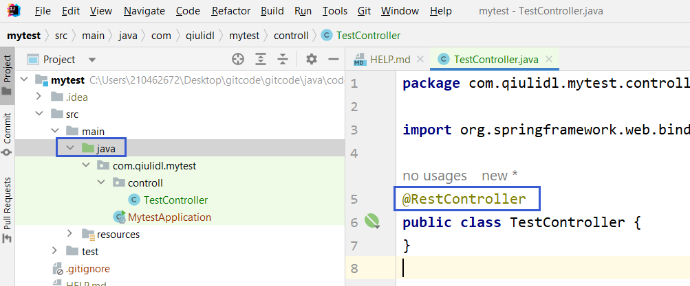

# devops学习

## 1. 配置template虚拟机

下载vmware，百度自己找个例子

配置虚拟机 

https://blog.csdn.net/weixin_44098426/article/details/128404337

https://www.runoob.com/w3cnote/vmware-install-centos7.html


## 2. 配置虚拟机ip

https://blog.csdn.net/li_wen_jin/article/details/127116174

## 3. 安装Mobaxterm终端链接工具

https://mobaxterm.mobatek.net/

## 4. 为虚拟机添加外网可以访问的端口映射
用花生壳做内网穿透https://hsk.oray.com/
获得虚拟机内网地址


## 2. Docker

### 2.1 安装docker

安装依赖 
```
yum -y install yum-utils device-mapper-persistent-data lvm2yy
```

设置下载docker的镜像源为阿里云
```
yum-config-manager --add-repo http://mirrors.aliyun.com/docker-ce/linux/centos/docker-ce.repo
```

安装docker
```
yum -y install docker-ce
```

启动docker服务
```
systemctl start docker
```

设置开机自动启动
```
systemctl enable docker
```
### 2.2 安装docker compose
去github上搜索docker/compose


安装tag上不带点的，稳定的，下载docker-compose-linux-x86_64


用Mobaxterm的SFTP连接把下载的文件上传到服务器。
重命名文件，加执行权限，并将其放入$PATH目录里。
```
mv docker-compose-linux-x86_64.64 docker-compose
chmod +x docker-compose
echo $PATH
mv docker-compose /usr/bin/
docker-compose version
```

## 3. GITLAB

### 3.1 Docker安装GITLAB

* 关闭防火墙并创建docker目录
```
systemctl stop firewalld
cd /usr/local
mkdir docker
cd docker/
mkdir gitlab_docker
vi docker-compose.yml
```

* 拉取gitlab镜像
```
docker pull gitlab/gitlab-ce
```

* 新建docker-compose.yml
```
version: '3.1'
services:
  gitlab:
    image: 'gitlab/gitlab-ce'
    container_name: gitlab
    restart: always
    environment:
      GITLAB_OMNIBUS_CONFIG: |
        external_url 'http://192.168.226.129:8929'
        gitlab_rails['gitlab_shell_ssh_port'] = 2224
    ports:
      - '8929:8929'
      - '2224:2224'
    volumes:
      - './config:/etc/gitlab'
      - './logs:/var/log/gitlab'
      - './data:/var/opt/gitlab'
```
```
docker-compose up -d
```

多等一会儿，然后浏览器输入192.168.226.128:8929检验

* 做花生壳穿透


### 3.2 GITLAB的root密码
```
docker exec -it gitlab bash   
cat /etc/gitlab/initial_root_password
```


## 4. 安装jenkins

### 4.1 下载
去jenkins网站jenkins.io查询版本获得pull命令。
```
docker pull jenkins/jenkins:2.319.1-lts
```

### 4.2 用docker-compose.yml部署jenkins

```
version: '3.1'
services:
  jenkins:
    image: 'jenkins/jenkins:2.319.1-lts'
    container_name: jenkins
    restart: always
    ports:
      - '8080:8080'
      - '50000:50000'
    volumes:
      - './data:/var/jenkins_home/'
```
部署jenkin，log里会有data文件夹的错误，看log给data文件夹赋权限
```
docker-compose up -d  //docker-compose -f filename up -d 默认是docker-compose.yml
                      //docker-compose -f filename down/stop/start/restart
docker logs -f jenkins 
chmod -R 777 data
```

log里也可以看到初始密码


### 4.3 首次安装jenkins，启动报错Failed to update the default Update Site ‘default’. Plugin upgrades may fail

https://blog.csdn.net/m0_43584016/article/details/102677494

解决方案：
先看有没有关闭防火墙,关闭防火墙后要重启docker
```
systemctl stop firewalld
service docker restart

vmware虚拟机重启会重新启动防火墙。
#查看firewall状态
systemctl status firewalld.service

#停止firewall
systemctl stop firewalld.service

#禁止firewall开机启动
systemctl disable firewalld.service
————————————————
版权声明：本文为CSDN博主「Qfoom」的原创文章，遵循CC 4.0 BY-SA版权协议，转载请附上原文出处链接及本声明。
原文链接：https://blog.csdn.net/Qfoom/article/details/108800787
```
找到 C:\Users\用户名.jenkins\hudson.model.UpdateCenter.xml 文件，

将 url 中的https更改为http，即去掉 https 中的 s 。
或者更改为
http://mirrors.tuna.tsinghua.edu.cn/jenkins/updates/update-center.json
是国内的，清华大学的镜像地址。

### 4.4 用docker安装的jenkins升级办法
https://blog.csdn.net/weixin_44443884/article/details/130573041

修改docker-compose添加卷映射 - './war:/usr/share/jenkins/' ，建立ref文件夹配置权限，把jenkins.war放入并配置权限，重启。
```
version: '3.1'
services:
  jenkins:
    image: 'jenkins/jenkins:2.319.1-lts'
    container_name: jenkins
    restart: always
    ports:
      - '8080:8080'
      - '50000:50000'
    volumes:
      - './data:/var/jenkins_home/'
      - './war:/usr/share/jenkins/'
```


### 4.5 下载jenkins插件

更改jenkins插件镜像源
https://www.cnblogs.com/mzline/p/16286152.html
git parameter
publish over SSH

### 4.6 配置JDK, MAVEN

百度搜索下载jdk和maven（maven.apache.org）, 下载linug版本.tar.gz
解压
```
tar -zxvf jdk-8u341-linux-x64.tar.gz -C ./
mv jdk1.8.0_341 jdk

tar -zxvf apache-maven-3.9.2-bin.tar.gz -C ./
mv apache-maven-3.9.2 maven
```

* 更改maven镜像地址和JDK
修改maven/conf/settings.xml
https://www.geek-share.com/detail/2733228929.html
https://blog.csdn.net/qq_43698787/article/details/129781559

* 在jenkins的global tool configuration中配置maven和jdk
把maven和jdk目录移动到/usr/local/docker/jenkins/data中，/var/jenkins_home映射到这了。


## 5. jenkins做CI

https://www.bilibili.com/video/BV13Y411E7nd?p=9&vd_source=2384206e0cca974945c9ce5d1cb7fbd0

### 5.1 Develop Java Code
source root一定要在java folder上，要不然@RestController等注解不起作用

新项目要VCS -> CREATE GIT REPOSITORY

### 5.2 Create Gitlab Project
https://www.bilibili.com/video/BV1gB4y1379L/?spm_id_from=333.337.search-card.all.click&vd_source=2384206e0cca974945c9ce5d1cb7fbd0

在gitlab中创建项目

* 在IDEA中安装Gitlab插件


* 在IDEA中添加Gitlab server


* 在IDEA中添加Gitlab remote


* 然后在IDEA中commit，push即可


### 5.3 配置jenkins

* 新建任务并连接gitlab，应用保存之后跑一边试试连接


* 连接成功之后所有工程都会放入用户目录/var/jenkins_home的workspace目录中。


* 设置jenkins maven构建步骤

build完成之后在workspace目录中会出现target目录。

* maven编译的时候一定要注意spring和JDK的版本，有的spring需要的JDK版本高。

### 5.4 CD操作  配置jenkins的SSH

* 配置SSH server


* 给jenkins project添加构建后操作
